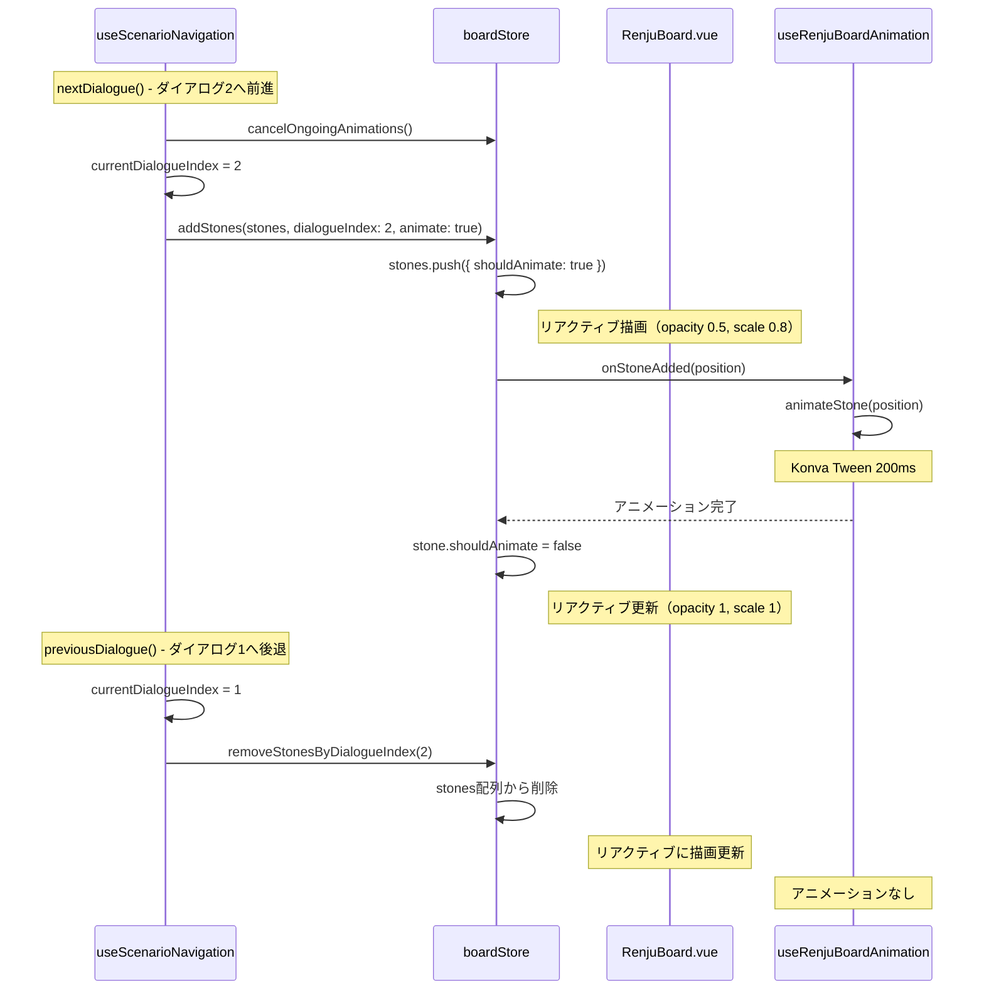
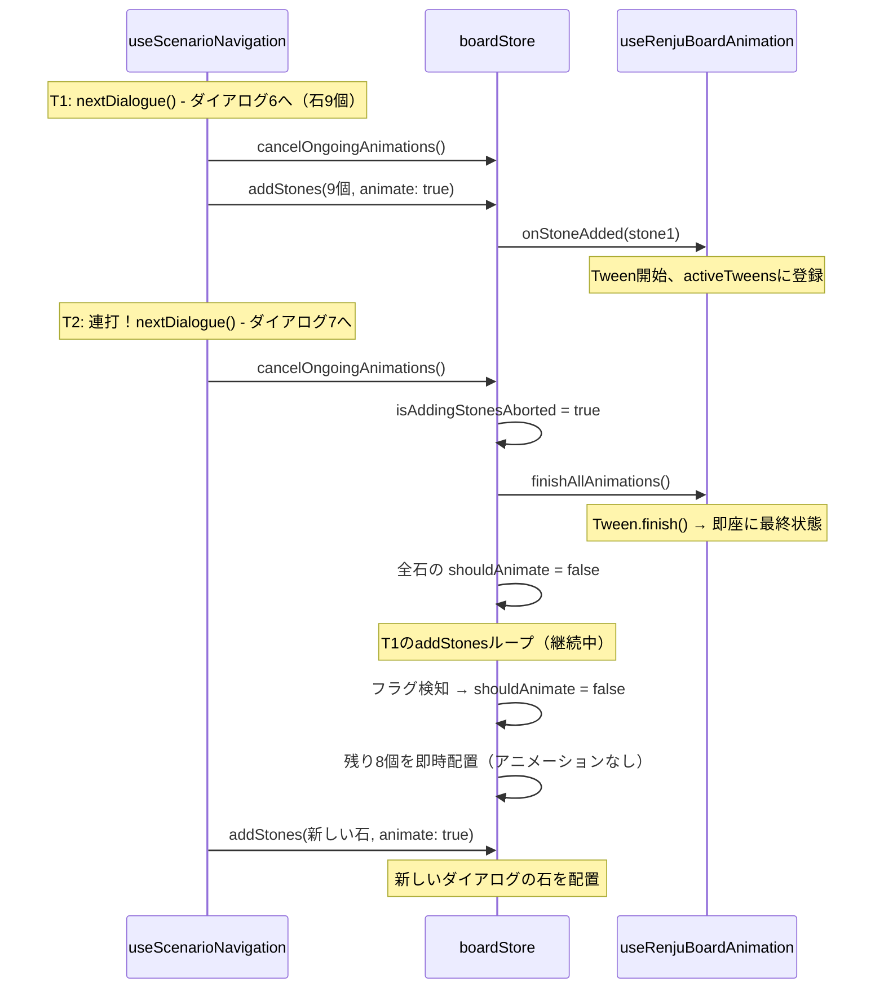

# デモモード石配置アニメーション再設計

## 現状の問題点（実装前）

### 1. 毎回盤面を再構築している

- `previousDialogue()`実行時、盤面を初期化後`applyActionsUntilDialogueIndex`で石を順次再配置
- 石がどのダイアログで配置されたか追跡していない
- 結果、戻る時も全石にアニメーションが発生

### 2. 関心の分離違反

- useScenarioNavigationが250msの待機時間を知っている（アニメーション実装詳細の漏洩）

### 3. Mark/Lineアニメーションの不安定さ

- `useRenjuBoardAnimation.ts`でFIXME付き、`return new Promise(() => {})`で無効化中

## あるべき動作

```
1.進む(石なし) → 2.進む(石配置、アニメーションあり) → 3.進む(石表示済み) → 4.進む(石表示済み)
4.戻る(石表示済み) → 3.戻る(石表示済み) → 2.戻る(石表示済み) → 1.戻る(石消える)
```

- 石はダイアログに紐づく
- 前進時: そのダイアログで配置される石のみアニメーション
- 後退時: アニメーションなし、表示/非表示は自動的に切り替わる
- 連打時: 進行中のアニメーションをキャンセルし、石は即時配置

## 設計方針

### 核心: 石にIDとダイアログインデックスを紐づけ

```typescript
interface Stone {
  id: string; // ユニークID
  position: Position;
  color: StoneColor;
  placedAtDialogueIndex: number; // どのダイアログで配置されたか
  shouldAnimate: boolean; // アニメーション待ちフラグ
}
```

### アニメーションと描画のタイミング制御

**問題**: 石をstones配列に追加すると即座にリアクティブ描画される。その後アニメーションを開始すると、一瞬フルサイズで表示される可能性がある。

**解決**: `shouldAnimate`フラグで初期表示状態を制御

```
1. stones.push({ ..., shouldAnimate: true }) → 描画（opacity 0.5, scale 0.8）
2. nextTick() → DOM確定
3. animateStone(pos) → Tween実行
4. 完了後 stone.shouldAnimate = false
```

### アニメーションキャンセル（連打対応）

**要件**: 「進む」ボタン連打時、進行中のアニメーションをキャンセルし、残りの石は即時配置する。

**解決**: 2つのメカニズムで制御

1. **Konva Tween管理**: `activeTweens` Mapで進行中のTweenを追跡、`tween.finish()`で即座に最終状態へジャンプ
2. **addStonesループ制御**: `isAddingStonesAborted`フラグでアニメーションをスキップ（配置は継続）

```
連打時の流れ:
1. nextDialogue() 呼び出し
2. cancelOngoingAnimations()
   - isAddingStonesAborted = true
   - finishAllAnimations() → 進行中のTweenを即座に完了
   - 既存石の shouldAnimate = false
3. 前回のaddStonesループ
   - フラグを検知 → shouldAnimate = false に切り替え
   - ループは継続、残りの石は即時配置（アニメーションなし）
4. 新しいaddStones実行
```

### 責務の整理

| 責務                       | 担当                                      |
| -------------------------- | ----------------------------------------- |
| ダイアログインデックス管理 | useScenarioNavigation                     |
| 石データ管理（追加・削除） | boardStore                                |
| アニメーション実行         | useRenjuBoardAnimation                    |
| 描画                       | RenjuBoard.vue（boardStore.stonesを参照） |

- 前進時: `boardStore.addStones()` で石を追加
- 後退時: `boardStore.removeStonesByDialogueIndex()` で石を削除
- 連打時: `boardStore.cancelOngoingAnimations()` でキャンセル
- ストアがリアクティブなので、参照先は自動更新

### 呼び出しフロー（通常時）



### 呼び出しフロー（連打時）



## 実装詳細

### boardStore.ts

```typescript
export interface Stone {
  id: string;
  position: Position;
  color: StoneColor;
  placedAtDialogueIndex: number;
  shouldAnimate: boolean;
}

// State
const stones = ref<Stone[]>([]);

// Callbacks
type OnStoneAddedCallback = (position: Position) => Promise<void>;
let onStoneAddedCallback: OnStoneAddedCallback | null = null;

type OnAnimationCancelCallback = () => void;
let onAnimationCancelCallback: OnAnimationCancelCallback | null = null;

// addStonesループ中断フラグ
let isAddingStonesAborted = false;

async function addStones(
  newStones: { position: Position; color: StoneColor }[],
  dialogueIndex: number,
  options?: { animate?: boolean },
): Promise<void> {
  let shouldAnimate = options?.animate !== false;
  isAddingStonesAborted = false;

  for (const stone of newStones) {
    // キャンセルされた場合はアニメーションをスキップ（配置は継続）
    if (isAddingStonesAborted) {
      shouldAnimate = false;
    }

    const id = `${dialogueIndex}-${stone.position.row}-${stone.position.col}`;
    const newStone: Stone = {
      id,
      position: stone.position,
      color: stone.color,
      placedAtDialogueIndex: dialogueIndex,
      shouldAnimate,
    };
    stones.value.push(newStone);

    if (shouldAnimate && onStoneAddedCallback) {
      await onStoneAddedCallback(stone.position);

      // await後も再チェック（アニメーション中にキャンセルされた可能性）
      if (isAddingStonesAborted) {
        shouldAnimate = false;
      }
      newStone.shouldAnimate = false;
    }
  }
}

function removeStonesByDialogueIndex(dialogueIndex: number): void {
  stones.value = stones.value.filter(
    (s) => s.placedAtDialogueIndex !== dialogueIndex,
  );
}

function clearStones(): void {
  stones.value = [];
}

function cancelOngoingAnimations(): void {
  // addStonesループを中断
  isAddingStonesAborted = true;

  // 進行中のTweenを即座に完了
  if (onAnimationCancelCallback) {
    onAnimationCancelCallback();
  }

  // shouldAnimateフラグも即座にfalseに
  for (const stone of stones.value) {
    if (stone.shouldAnimate) {
      stone.shouldAnimate = false;
    }
  }
}

function setOnStoneAddedCallback(callback: OnStoneAddedCallback | null): void {
  onStoneAddedCallback = callback;
}

function setOnAnimationCancelCallback(
  callback: OnAnimationCancelCallback | null,
): void {
  onAnimationCancelCallback = callback;
}
```

### useRenjuBoardAnimation.ts

```typescript
export function useRenjuBoardAnimation(layout: LayoutType) {
  const stoneRefs: Record<string, unknown> = {};
  const activeTweens = new Map<string, Konva.Tween>();

  const animateStone = (position: Position): Promise<void> =>
    new Promise((resolve) => {
      nextTick(() => {
        const stoneKey = `${position.row}-${position.col}`;
        const nodeRef = stoneRefs[stoneKey];
        if (!nodeRef) {
          resolve();
          return;
        }

        const konvaNode = nodeRef.getNode?.();
        if (!konvaNode) {
          resolve();
          return;
        }

        const targetY = layout.positionToPixels(position.row, position.col).y;
        const startY = targetY - layout.CELL_SIZE.value * 0.25;
        konvaNode.y(startY);

        const tween = new Konva.Tween({
          node: konvaNode,
          duration: 0.2,
          y: targetY,
          opacity: 1,
          scaleX: 1,
          scaleY: 1,
          easing: Konva.Easings.EaseOut,
          onFinish: () => {
            activeTweens.delete(stoneKey);
            resolve();
          },
        });

        activeTweens.set(stoneKey, tween);
        tween.play();
      });
    });

  const finishAllAnimations = (): void => {
    for (const [, tween] of activeTweens.entries()) {
      tween.finish(); // 最終状態へジャンプ、onFinish実行
    }
    activeTweens.clear();
  };

  return {
    stoneRefs,
    animateStone,
    finishAllAnimations,
  };
}
```

### RenjuBoard.vue（コールバック登録）

```typescript
onMounted(() => {
  // シナリオ用: 石追加時のアニメーションコールバック
  boardStore.setOnStoneAddedCallback(async (position: Position) => {
    await animation.animateStone(position);
  });

  // アニメーションキャンセルコールバック
  boardStore.setOnAnimationCancelCallback(() => {
    animation.finishAllAnimations();
  });
});

onBeforeUnmount(() => {
  boardStore.setOnStoneAddedCallback(null);
  boardStore.setOnAnimationCancelCallback(null);
});
```

### useScenarioNavigation.ts（nextDialogue）

```typescript
const nextDialogue = async (): Promise<void> => {
  // 進行中のアニメーションをキャンセル（連打対応）
  boardStore.cancelOngoingAnimations();

  if (currentDialogueIndex.value < allDialogues.value.length - 1) {
    currentDialogueIndex.value += 1;
    const mapping = allDialogues.value[currentDialogueIndex.value];

    // ... セクション切り替え処理 ...

    await showDialogueWithAction(mapping.dialogue, true);
  }
};
```

## ファイル変更一覧

| ファイル                                                                       | 変更内容                                                                                      |
| ------------------------------------------------------------------------------ | --------------------------------------------------------------------------------------------- |
| `src/stores/boardStore.ts`                                                     | Stone型、stones、addStones、removeStonesByDialogueIndex、clearStones、cancelOngoingAnimations |
| `src/components/game/RenjuBoard/composables/useRenjuBoardAnimation.ts`         | animateStone、finishAllAnimations、activeTweens管理                                           |
| `src/components/game/RenjuBoard/RenjuBoard.vue`                                | boardStore.stonesを直接参照、コールバック登録                                                 |
| `src/components/scenarios/ScenarioPlayer/composables/useScenarioNavigation.ts` | addStones/removeStonesByDialogueIndex呼び出し、cancelOngoingAnimations呼び出し                |

## スコープ外（将来対応）

- Mark/Lineアニメーションの再設計・実装

## 期待される効果

1. **関心の分離**: アニメーション詳細がRenjuBoard内に閉じる
2. **タイミング同期**: 実際のアニメーション完了を待機
3. **コードのシンプル化**: 250ms定数が不要に
4. **連打対応**: アニメーションキャンセルと即時配置を両立
5. **テスタビリティ向上**: アニメーション層を独立してテスト可能
