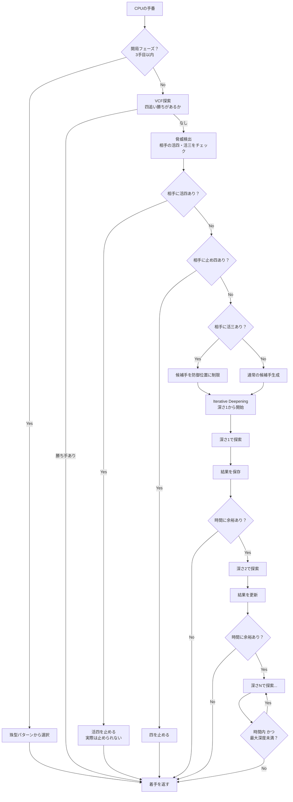

# CPUアルゴリズム解説

このドキュメントでは、連珠（五目並べ）CPUの思考ロジックを、プログラミング初心者向けに解説します。

## 目次

1. [概要](#概要)
2. [基本的な考え方](#基本的な考え方)
3. [主要アルゴリズムの説明](#主要アルゴリズムの説明)
4. [処理の流れ](#処理の流れ)
5. [評価関数（スコアの付け方）](#評価関数スコアの付け方)
6. [難易度パラメータの効き方](#難易度パラメータの効き方)
7. [ファイル構成](#ファイル構成)

---

## 概要

CPUは「次にどこに石を置くか」を以下の手順で決定します。

1. **開局フェーズ**: 最初の3手は定石パターン（珠型）から選択
2. **VCF探索**: 四追い勝ち（連続で四を作って勝つ手順）があるかチェック
3. **脅威検出**: 相手の活四・活三などの危険な形を検出し、必須の防御手を特定
4. **Minimax探索**: 数手先を読んで最善手を選択

### 使用している主要なアルゴリズム

| アルゴリズム                  | ひとことで言うと                                   |
| ----------------------------- | -------------------------------------------------- |
| Minimax                       | 「自分は最大、相手は最小を選ぶ」ゲーム木探索       |
| Alpha-Beta剪定                | 「調べなくても結果が変わらない手は省略」する最適化 |
| Iterative Deepening           | 「時間内でできるだけ深く読む」仕組み               |
| Transposition Table（置換表） | 「同じ局面の計算結果を覚えておく」キャッシュ       |
| Zobrist Hashing               | 「盤面を数値1つで表す」ハッシュ技術                |
| Move Ordering                 | 「良さそうな手から先に調べる」と効率UP             |
| Killer Moves                  | 「前に効果的だった手を優先」するヒューリスティック |
| History Heuristic             | 「過去の統計から良い手を予測」する手法             |
| Late Move Reductions (LMR)    | 「後半の手は浅く調べる」省略テクニック             |
| VCF探索                       | 「四追い勝ち」の専用探索                           |
| VCT探索                       | 「三・四連続勝ち」の専用探索                       |

---

## 基本的な考え方

### 先読みの概念

CPUは将棋や囲碁のAIと同じように「先読み」をします。

```
自分が A に打ったら、相手は B に打つだろう。
そうしたら自分は C に打って、相手は D に打つだろう。
その結果、自分は三々が作れるから有利になる。
→ だから A に打とう！
```

このように、数手先まで「自分が打ったら、相手はこう打つだろう」という予測の連鎖を繰り返し、最も良い結果になる手を選びます。

### スコアによる評価

「良い」「悪い」を数値（スコア）で表します。

- **高いスコア**: CPUにとって有利な局面
- **低いスコア**: CPUにとって不利な局面
- **100000点**: 五連完成（勝利確定）
- **-100000点**: 相手が五連完成（負け確定）

---

## 主要アルゴリズムの説明

### 1. Minimax（ミニマックス）

**ひとことで言うと**: 「自分は最大、相手は最小を選ぶ」という考え方でゲーム木を探索するアルゴリズム

#### なぜ必要か

ゲームでは自分だけでなく相手も最善を尽くします。「相手は自分にとって最悪の手を打ってくる」と仮定して、その中で最も良い結果になる手を選ぶ必要があります。

#### 考え方

```
自分の手番: 自分にとって最大（MAX）のスコアになる手を選ぶ
相手の手番: 自分にとって最小（MIN）のスコアになる手を選ぶ
              ↑ 相手にとっては最大だが、自分視点では最小
```

#### 数式

```
minimax(局面, 深さ, 最大化プレイヤーか) =
  if 深さ = 0 または 終端局面:
    return 評価値

  if 最大化プレイヤー:
    return max(minimax(子局面, 深さ-1, false) for 各候補手)
  else:
    return min(minimax(子局面, 深さ-1, true) for 各候補手)
```

**式の意味**:

- `深さ = 0`: これ以上先読みしない
- `終端局面`: 勝敗が決まった状態
- `最大化プレイヤー`: 自分の手番（スコアを最大化したい）
- `子局面`: ある手を打った後の盤面

#### 具体例

```
現在の局面（自分の手番）
├── 手A を打つ → スコア +100
│   ├── 相手が B1 を打つ → スコア +50
│   └── 相手が B2 を打つ → スコア +150
│   → 相手は最小を選ぶので +50
├── 手B を打つ → スコア +80
│   ├── 相手が C1 を打つ → スコア +70
│   └── 相手が C2 を打つ → スコア +90
│   → 相手は最小を選ぶので +70
└── 自分は最大を選ぶので、手B（+70）を選択
```

---

### 2. Alpha-Beta剪定（アルファベータ枝刈り）

**ひとことで言うと**: 「調べなくても結果が変わらない手は省略」して探索を高速化する技術

#### なぜ必要か

Minimaxは全ての手を調べるため、候補手が多いと計算量が爆発的に増えます。Alpha-Beta剪定を使うと、調べる必要のない手をスキップできます。

#### 考え方

```
α（アルファ）: 最大化プレイヤーが保証できる最低スコア
β（ベータ）  : 最小化プレイヤーが保証できる最高スコア

α >= β になったら、それ以上調べても結果は変わらないのでスキップ（剪定）
```

#### 数式

```
alphabeta(局面, 深さ, α, β, 最大化か) =
  if 深さ = 0 または 終端:
    return 評価値

  if 最大化プレイヤー:
    for 各候補手:
      α = max(α, alphabeta(子局面, 深さ-1, α, β, false))
      if β <= α:
        break  // β剪定（これ以上調べても無駄）
    return α
  else:
    for 各候補手:
      β = min(β, alphabeta(子局面, 深さ-1, α, β, true))
      if β <= α:
        break  // α剪定（これ以上調べても無駄）
    return β
```

**式の意味**:

- `α = max(α, スコア)`: 自分が保証できる最低スコアを更新
- `β = min(β, スコア)`: 相手が保証できる最高スコアを更新
- `β <= α`: 相手がこの手を選ばないことが確定（剪定可能）

#### 具体例

```
自分の手番（最大化）
├── 手A → 相手の応手を調べ中... → スコア +70 確定
│   → α = 70 に更新
├── 手B → 相手の応手を調べ中...
│   ├── 相手が B1 → スコア +50
│   │   → β = 50 に更新
│   │   → α(70) >= β(50) なので剪定！
│   │   → 手B は +50 以下が確定、手A(+70)より悪いので調べる意味なし
│   └── 相手が B2 → 調べない（剪定済み）
└── 結果: 手A を選択
```

---

### 3. Iterative Deepening（反復深化）

**ひとことで言うと**: 「時間内でできるだけ深く読む」仕組み

#### なぜ必要か

- 探索深度が深いほど良い手が見つかるが、時間がかかる
- 時間制限があるので、深すぎると間に合わない
- 最適な深度は局面によって変わる

#### 考え方

```
深さ1で探索 → 結果を保存
深さ2で探索 → 結果を更新
深さ3で探索 → 結果を更新
...
時間切れ → 最後に完了した深さの結果を使用
```

#### メリット

1. **時間管理**: 常に「前の深さの結果」があるので、時間切れでも手を返せる
2. **Move Ordering改善**: 浅い探索で見つけた最善手を、深い探索で先に調べられる
3. **Transposition Table活用**: 浅い探索の結果を深い探索で再利用

```typescript
// 実装の概要（minimax.ts:479-530）
function findBestMoveIterative(board, color, maxDepth, timeLimit) {
  let bestResult = findBestMove(board, color, 1); // 深さ1で開始
  let completedDepth = 1;

  for (let depth = 2; depth <= maxDepth; depth++) {
    if (経過時間 > timeLimit * 0.5) {
      break; // 残り時間が少ないので中断
    }

    bestResult = findBestMove(board, color, depth);
    completedDepth = depth;
  }

  return { ...bestResult, completedDepth };
}
```

---

### 4. Transposition Table（置換表）

**ひとことで言うと**: 「同じ局面の計算結果を覚えておく」キャッシュ

#### なぜ必要か

連珠では、異なる手順で同じ局面に到達することがあります。

```
手順1: A → B → C → D
手順2: A → D → C → B
→ 同じ局面！
```

同じ局面を何度も評価するのは無駄なので、結果を保存して再利用します。

#### データ構造

```typescript
interface TTEntry {
  hash: bigint; // 盤面のハッシュ値（識別用）
  score: number; // 評価スコア
  depth: number; // 探索した深さ
  type: ScoreType; // スコアの種類（後述）
  bestMove: Position; // この局面での最善手
  generation: number; // 世代番号（古いエントリ置換用）
}
```

#### スコアタイプの意味

```
EXACT      : 正確な評価値（α < score < β で求まった）
LOWER_BOUND: 下限値（β剪定で打ち切られた = 実際はこれ以上）
UPPER_BOUND: 上限値（α剪定で打ち切られた = 実際はこれ以下）
```

---

### 5. Zobrist Hashing（ゾブリストハッシュ）

**ひとことで言うと**: 「盤面を数値1つで表す」技術

#### なぜ必要か

Transposition Tableで盤面を検索するには、盤面を識別するキーが必要です。15×15の盤面をそのまま比較すると遅いので、数値1つに変換します。

#### XOR演算とは

```
XOR（排他的論理和）の性質:
- A XOR B = C
- C XOR B = A  // 同じ値を2回XORすると元に戻る

例: 0b1010 XOR 0b1100 = 0b0110
    0b0110 XOR 0b1100 = 0b1010  // 元に戻る
```

#### 仕組み

1. 各マス × 各色（黒/白）に対して、ランダムな64ビット数値を事前に生成
2. 盤面のハッシュ = 全ての石のランダム値をXORした結果

```typescript
// zobrist.ts の実装
const zobristTable = [[[ランダム値, ランダム値], ...]...]  // [row][col][color]

function computeBoardHash(board) {
  let hash = 0n;  // BigInt
  for (各マス (row, col)) {
    if (石がある) {
      hash ^= zobristTable[row][col][colorIndex];  // XOR
    }
  }
  return hash;
}
```

#### 差分更新

石を1つ置く/取る場合、全体を再計算する必要はありません。

```typescript
function updateHash(hash, row, col, color) {
  // XORの性質: 同じ値を2回XORすると元に戻る
  // → 石を置く: XOR で追加
  // → 石を取る: XOR で削除（同じ操作）
  return hash ^ zobristTable[row][col][colorIndex];
}
```

**例**: 黒石を H8 に置く場合

```
新ハッシュ = 旧ハッシュ XOR zobristTable[7][7][黒]
```

---

### 6. Move Ordering（手の並び替え）

**ひとことで言うと**: 「良さそうな手から先に調べる」と効率UP

#### なぜ必要か

Alpha-Beta剪定の効果は、良い手を先に調べるほど大きくなります。

```
最良の手を最初に調べた場合:
├── 手A（最善）→ スコア +100 → α = 100
├── 手B → スコア +50 < α → 剪定しやすい
└── 手C → スコア +30 < α → 剪定しやすい

最悪の手を最初に調べた場合:
├── 手C（最悪）→ スコア +30 → α = 30
├── 手B → スコア +50 > α → 剪定できない、全探索
└── 手A → スコア +100 > α → 剪定できない、全探索
```

#### 優先度（高い順）

1. **TT最善手**: 前回の探索で見つかった最善手
2. **Killer Moves**: 同じ深さで剪定を引き起こした手
3. **静的評価**: 盤面を見て「良さそう」と判断した手
4. **History Heuristic**: 過去に剪定を引き起こした手の統計

---

### 7. Killer Moves（キラームーブ）

**ひとことで言うと**: 「前に効果的だった手を優先」するヒューリスティック

#### 考え方

ある深さでBeta剪定（相手の応手で打ち切り）を引き起こした手は、同じ深さの他の局面でも有効な可能性が高い。

```
深さ3で、手 H8 が剪定を引き起こした
→ 同じ深さ3の他の局面でも、H8 を優先的に調べる
```

#### データ構造

```typescript
// 各深さに対して、最大2手を記憶
KillerMoves[深さ][0] = 最も新しいKiller Move
KillerMoves[深さ][1] = 2番目に新しいKiller Move
```

---

### 8. History Heuristic（ヒストリーヒューリスティック）

**ひとことで言うと**: 「過去の統計から良い手を予測」する手法

#### 考え方

過去の探索で剪定を引き起こした手の「成功回数」を記録し、成功率が高い手を優先的に調べます。

```typescript
// History Table: [row][col] => スコア
HistoryTable[7][7] = 1500; // H8 は過去に多く剪定を引き起こした

// 剪定を引き起こした時に更新
function updateHistory(history, move, depth) {
  // 深い探索での成功ほど重要 → depth² で重み付け
  history[move.row][move.col] += depth * depth;
}
```

#### Killer Moves との違い

| 項目     | Killer Moves | History Heuristic |
| -------- | ------------ | ----------------- |
| 記憶範囲 | 同じ深さのみ | 全探索を通じて    |
| 記憶数   | 各深さ2手    | 全マス            |
| 更新方法 | 上書き       | 累積              |
| 局面依存 | 深さのみ     | 位置のみ          |

---

### 9. Late Move Reductions (LMR)

**ひとことで言うと**: 「後半の手は浅く調べる」省略テクニック

#### なぜ必要か

Move Orderingにより、良い手は前の方に来ます。つまり、後ろの方の手は「あまり良くない」可能性が高い。あまり良くない手を深く調べるのは無駄なので、浅く調べて本当に良さそうなら再探索します。

#### アルゴリズム

```typescript
for (let i = 0; i < moves.length; i++) {
  if (i >= 4 && depth >= 3) {
    // 5手目以降 かつ 深さ3以上なら、1手浅く探索
    score = search(depth - 1 - 1);  // 削減量 = 1

    if (score が有望) {
      // 有望なら通常の深さで再探索
      score = search(depth - 1);
    }
  } else {
    // 最初の4手は通常の深さで探索
    score = search(depth - 1);
  }
}
```

#### パラメータ（本実装）

```typescript
LMR_MOVE_THRESHOLD = 4; // 5手目以降（インデックス4以上）で適用
LMR_MIN_DEPTH = 3; // 深さ3以上で適用
LMR_REDUCTION = 1; // 削減量
```

---

### 10. VCF探索（Victory by Continuous Fours）

**ひとことで言うと**: 「四追い勝ち」の専用探索

#### 四追い勝ちとは

四（あと1手で五連になる形）を連続で作り続け、相手が止めている間に最終的に五連を完成させる勝ち方。

```
自分: 四を作る（・●●●●・）
相手: 止める（○●●●●・）
自分: 別の四を作る（・●●●●○）
相手: 止める
...
自分: 最後の四を作る → 相手が止められない → 勝利
```

#### 白番の特殊ケース

連珠では黒には禁手（三三、四四、長連）があります。白が四を作った時、黒の防御位置が禁手なら、黒は止められないので白の勝利となります。

```typescript
// vcf.ts の実装概要
function hasVCF(board, color, depth) {
  if (depth >= 8) return false;  // 探索上限

  for (四を作れる各手) {
    四を作った盤面を生成;

    if (五連完成) return true;

    防御位置 = 四を止める位置を取得;

    if (防御位置がない) return true;  // 活四（両端開き）

    if (color === "white" && 防御位置が禁手) {
      return true;  // 黒が止められない
    }

    相手が防御した盤面を生成;

    if (hasVCF(相手が防御した盤面, color, depth + 1)) {
      return true;  // 四追いが続く
    }
  }

  return false;
}
```

---

### 11. VCT探索（Victory by Continuous Threats）

**ひとことで言うと**: 「三・四連続勝ち」の専用探索

#### VCFとの違い

| 項目         | VCF                     | VCT                            |
| ------------ | ----------------------- | ------------------------------ |
| 使える脅威   | 四のみ                  | 四 + 活三                      |
| 相手の選択肢 | 1通り（止めるしかない） | 複数（どちらを止めるか選べる） |
| 計算量       | 少ない                  | 多い                           |
| 探索深度     | 8手                     | 4手                            |

#### アルゴリズム

```typescript
function hasVCT(board, color, depth) {
  if (depth >= 4) return false;

  // VCFがあればVCT成立（VCF ⊂ VCT）
  if (hasVCF(board, color)) return true;

  for (脅威（四・活三）を作れる各手) {
    脅威を作った盤面を生成;

    防御位置リスト = 脅威を止める位置を全て取得;

    if (防御位置がない) {
      return true;  // 活四など、止められない
    }

    // 全ての防御に対してVCTが続くか確認
    全防御成功 = true;
    for (各防御位置) {
      相手が防御した盤面を生成;
      if (!hasVCT(相手が防御した盤面, color, depth + 1)) {
        全防御成功 = false;
        break;
      }
    }

    if (全防御成功) return true;
  }

  return false;
}
```

---

## 処理の流れ



---

## 評価関数（スコアの付け方）

### パターンスコア一覧

評価関数は、盤面上の石のパターンにスコアを付けて「良し悪し」を数値化します。

| パターン                     | スコア  | 説明                                 |
| ---------------------------- | ------- | ------------------------------------ |
| **五連（FIVE）**             | 100,000 | 勝利確定                             |
| **活四（OPEN_FOUR）**        | 10,000  | 両端が開いた四連。相手は止められない |
| **禁手追い込み強**           | 8,000   | 白の四の防御点が黒の禁手             |
| **四三ボーナス**             | 5,000   | 四と活三を同時に作る                 |
| **禁手追い込み三**           | 3,000   | 三の達四点の一方が禁手               |
| **フクミ手ボーナス**         | 1,500   | 次にVCF（四追い勝ち）がある手        |
| **禁手追い込みセットアップ** | 1,500   | 活三の延長点が禁手                   |
| **ミセ手ボーナス**           | 1,000   | 次に四三を作れる手                   |
| **止め四（FOUR）**           | 1,000   | 片端だけ開いた四連                   |
| **活三（OPEN_THREE）**       | 1,000   | 両端が開いた三連                     |
| **複数方向脅威ボーナス**     | 500     | 2方向以上で脅威を作る                |
| **活二（OPEN_TWO）**         | 50      | 両端が開いた二連                     |
| **止め三（THREE）**          | 30      | 片端だけ開いた三連                   |
| **止め二（TWO）**            | 10      | 片端だけ開いた二連                   |
| **中央ボーナス**             | 0〜5    | 中央に近いほど高い                   |

### 攻撃と防御のバランス

```
最終スコア = 攻撃スコア + 防御スコア + 各種ボーナス

攻撃スコア = 自分のパターンスコア合計
防御スコア = 相手のパターンスコア合計 × 0.5
```

**防御スコアが0.5倍の理由**: 攻撃（自分の形を強くする）の方が、防御（相手の形を止める）より重要度が高いため。

### 連珠特有の用語

| 用語         | 意味                                 | 例          |
| ------------ | ------------------------------------ | ----------- |
| **活四**     | 両端が開いた四連。次に必ず五連になる | `・●●●●・`  |
| **止め四**   | 片端だけ開いた四連。止められる       | `○●●●●・`   |
| **活三**     | 両端が開いた三連。次に活四になる     | `・●●●・`   |
| **止め三**   | 片端だけ開いた三連                   | `○●●●・`    |
| **跳び四**   | 1マス空きの四連                      | `●●・●●`    |
| **跳び三**   | 1マス空きの三連                      | `・●・●●・` |
| **フクミ手** | 次にVCF（四追い勝ち）がある手        |             |
| **ミセ手**   | 次に四三（四と活三同時）を作れる手   |             |
| **四三**     | 四と活三を同時に作ること。防御不可能 |             |
| **三三**     | 活三を2つ同時に作ること。黒の禁手    |             |
| **四四**     | 四を2つ同時に作ること。黒の禁手      |             |
| **長連**     | 6つ以上連続。黒の禁手                |             |

### スコア計算の流れ

```typescript
function evaluatePosition(board, row, col, color) {
  // 1. 五連チェック（最優先）
  if (checkFive(...)) return 100000;

  // 2. 仮想的に石を置いて評価
  testBoard = copyBoard(board);
  testBoard[row][col] = color;

  // 3. 攻撃スコア（自分のパターン）
  attackScore = evaluateStonePatterns(testBoard, row, col, color);

  // 4. 防御スコア（相手のパターンを阻止）
  testBoard[row][col] = opponentColor;
  defenseScore = evaluateStonePatterns(...) * 0.5;

  // 5. 各種ボーナス
  fourThreeBonus = (四と活三を同時) ? 5000 : 0;
  miseBonus = (次に四三可能) ? 1000 : 0;
  centerBonus = getCenterBonus(row, col);
  ...

  // 6. 合計
  return attackScore + defenseScore + fourThreeBonus + miseBonus + centerBonus + ...;
}
```

---

## 難易度パラメータの効き方

### パラメータ一覧

| パラメータ     | 説明                                           |
| -------------- | ---------------------------------------------- |
| `depth`        | 最大探索深度。深いほど強い                     |
| `timeLimit`    | 時間制限（ミリ秒）。長いほど深く読める         |
| `randomFactor` | ランダム要素（0〜1）。高いほど悪手を打ちやすい |
| `maxNodes`     | 探索ノード数上限。多いほど広く読める           |
| 評価オプション | 評価関数の機能ON/OFF                           |

### 難易度別の設定比較

| パラメータ       | beginner | easy   | medium  | hard     |
| ---------------- | -------- | ------ | ------- | -------- |
| 探索深度         | 1        | 2      | 4       | 5        |
| 時間制限         | 1秒      | 2秒    | 4秒     | 6秒      |
| ランダム要素     | 45%      | 40%    | 15%     | 0%       |
| ノード上限       | 10,000   | 50,000 | 200,000 | 600,000  |
| フクミ手評価     | ✗        | ✗      | ✗       | ✓        |
| ミセ手評価       | ✗        | ✗      | ✓       | ✓        |
| 禁手追い込み     | ✗        | ✗      | ✗       | ✓        |
| 複数方向脅威     | ✗        | ✗      | ✓       | ✓        |
| カウンターフォー | ✗        | ✗      | ✓       | ✓        |
| VCT探索          | ✗        | ✗      | ✗       | ✓        |
| 必須防御         | ✗        | ✗      | ✓       | ✓        |
| 単発四ペナルティ | ✗        | ✗      | ✓ (30%) | ✓ (100%) |
| ミセ脅威対応     | ✗        | ✗      | ✓       | ✓        |

### なぜその設定で強さが変わるか

#### 探索深度の効果

```
深さ1: 次の1手だけ見る → 目先の良さだけで判断
深さ3: 自→相→自 の3手先まで見る → 相手の応手を考慮
深さ5: 5手先まで見る → 複雑な読み合いができる
```

#### ランダム要素の効果

```
randomFactor = 0%: 常に最善手を選択
randomFactor = 45%: 45%の確率で次善以下の手を選択
→ 明らかな悪手を打つことがある
```

#### 評価オプションの効果

| オプション       | 効果                                 |
| ---------------- | ------------------------------------ |
| フクミ手評価     | 四追い勝ちにつながる手を高評価       |
| 必須防御         | 相手の脅威を見逃さない               |
| 単発四ペナルティ | 後続のない四を低評価（無駄打ち防止） |
| VCT探索          | 三・四連続勝ちを読み切る             |

---

## ファイル構成

```
src/logic/cpu/
├── index.ts              # 公開API（export）
├── evaluation.ts         # 評価関数（スコア計算）
├── moveGenerator.ts      # 候補手生成、Move Ordering
├── zobrist.ts           # Zobrist Hashing（盤面ハッシュ）
├── transpositionTable.ts # Transposition Table（置換表）
├── opening.ts           # 開局（珠型）ロジック
├── cpu.worker.ts        # Web Worker（メインスレッドをブロックしない）
│
├── search/
│   ├── index.ts         # 探索API
│   ├── minimax.ts       # Minimax + Alpha-Beta + Iterative Deepening
│   ├── vcf.ts           # VCF探索（四追い勝ち）
│   └── vct.ts           # VCT探索（三・四連続勝ち）
│
├── core/
│   ├── constants.ts     # 定数（方向ベクトルなど）
│   ├── boardUtils.ts    # 盤面操作ユーティリティ
│   └── lineAnalysis.ts  # ライン解析（連の端を調べる）
│
├── patterns/
│   └── threatAnalysis.ts # 脅威パターン解析
│
└── benchmark/
    ├── index.ts         # ベンチマーク実行
    ├── rating.ts        # レーティング計算
    └── headless.ts      # ヘッドレステスト用
```

### 各ファイルの役割

| ファイル                | 役割                                         |
| ----------------------- | -------------------------------------------- |
| `evaluation.ts`         | 盤面・位置の評価スコアを計算                 |
| `moveGenerator.ts`      | 候補手を生成し、優先度順にソート             |
| `zobrist.ts`            | 盤面をハッシュ値に変換                       |
| `transpositionTable.ts` | 計算結果をキャッシュ                         |
| `minimax.ts`            | Minimax探索の本体、Iterative Deepeningを含む |
| `vcf.ts`                | 四追い勝ちの探索                             |
| `vct.ts`                | 三・四連続勝ちの探索                         |
| `opening.ts`            | 開局定石（珠型）の選択                       |

---

## 参考文献

- [Minimax Algorithm - Wikipedia](https://en.wikipedia.org/wiki/Minimax)
- [Alpha-beta pruning - Wikipedia](https://en.wikipedia.org/wiki/Alpha%E2%80%93beta_pruning)
- [Iterative deepening depth-first search - Wikipedia](https://en.wikipedia.org/wiki/Iterative_deepening_depth-first_search)
- [Zobrist hashing - Wikipedia](https://en.wikipedia.org/wiki/Zobrist_hashing)
- [Transposition table - Chess Programming Wiki](https://www.chessprogramming.org/Transposition_Table)
