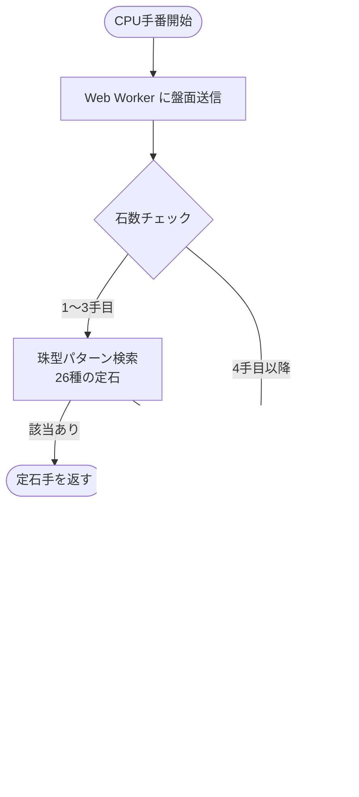
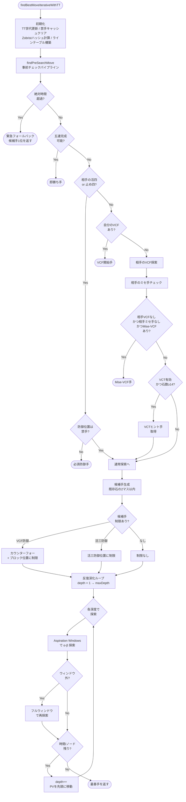
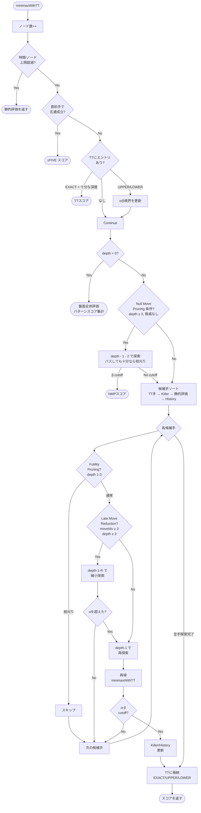
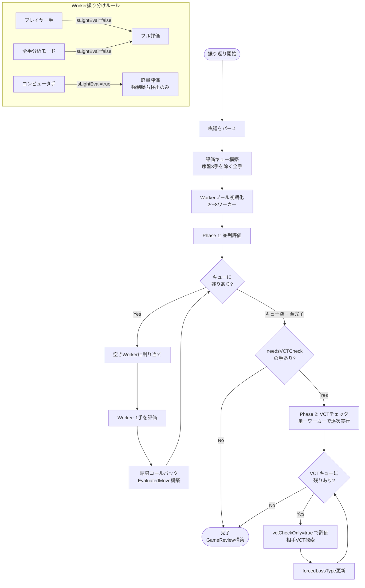
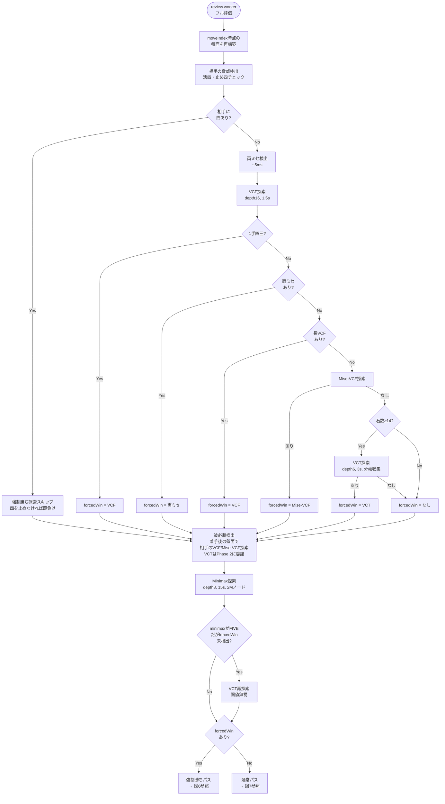
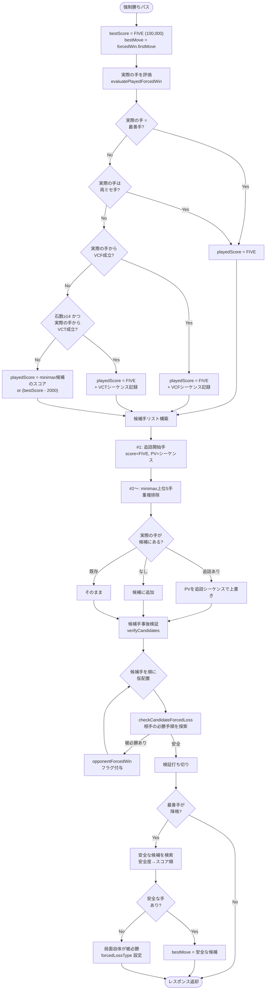
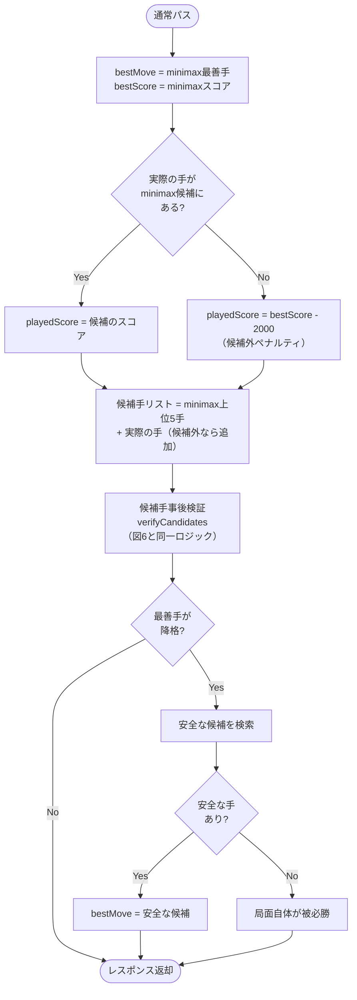
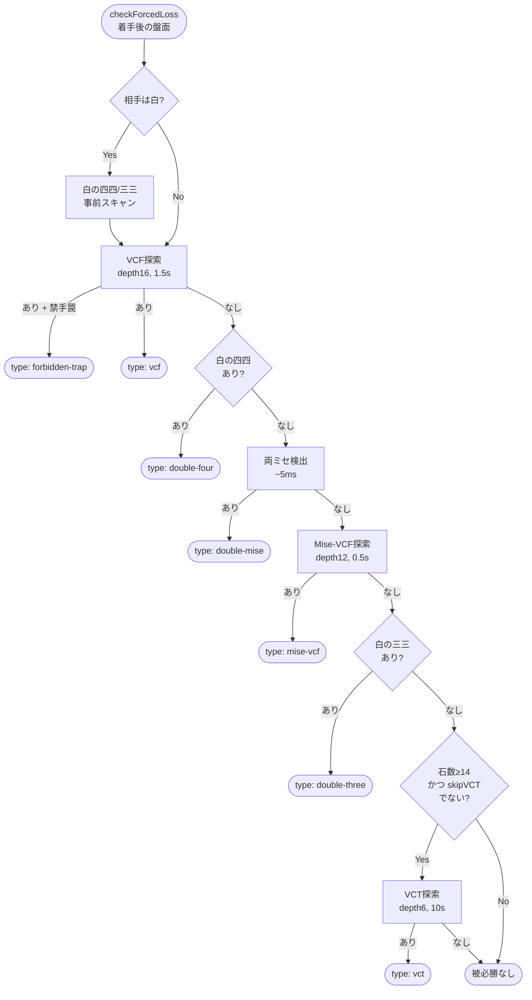
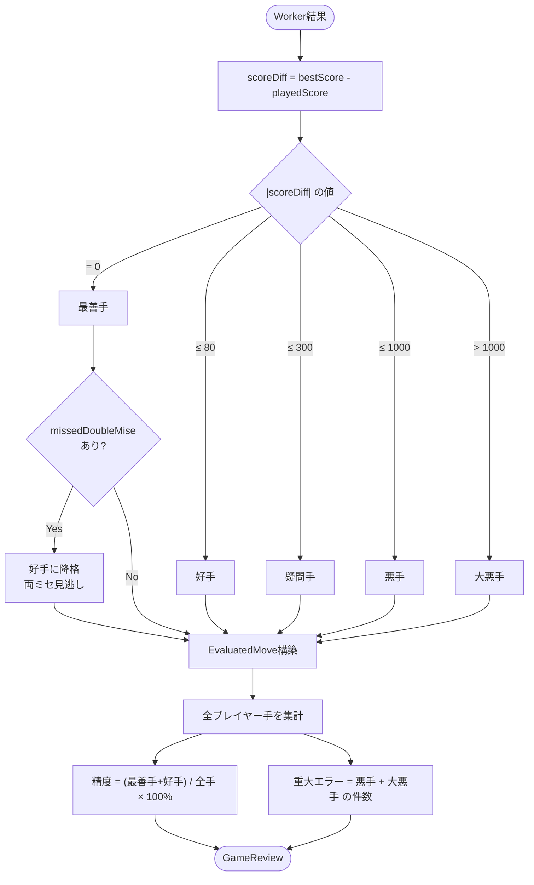

# CPU対戦・振り返り分析 - フローチャート集

> **注記**: TS時代のフローチャート。処理の概念フローは現行Zig版と共通だが、関数名は異なる。

CPU の着手選択ロジックと振り返り分析の全体像を Mermaid フローチャートで可視化したドキュメント。

---

## 1. CPU対戦 - 最善手算出フロー（全体）

### 難易度パラメータ一覧

| 難易度 | 深度 | 時間 | ランダム | ノード上限 | 有効な戦術               |
| ------ | ---- | ---- | -------- | ---------- | ------------------------ |
| 初級   | 2    | 1.5s | 25%      | 30K        | 必須防御のみ             |
| 初中級 | 2    | 2s   | 12%      | 100K       | + ミセ, カウンターフォー |
| 中級   | 3    | 5s   | 8%       | 200K       | + VCT, 枝刈り            |
| 上級   | 4    | 10s  | 0%       | 600K       | 全機能                   |

---

## 2. CPU対戦 - 事前チェック → 反復深化（詳細）

---

## 3. CPU対戦 - Minimax探索（1ノード内部）

---

## 4. 振り返り分析 - 全体フロー

---

## 5. 振り返り分析 - 1手の評価（Worker内部・フル評価パス）

---

## 6. 振り返り分析 - 強制勝ちパス（候補手構築 + スコア算出）

---

## 7. 振り返り分析 - 通常パス（forcedWinなし）

---

## 8. 共通 - 被必勝検出（checkForcedLoss）

着手後の盤面で相手側から見た必勝手順を探索する。
CPU探索の事前チェック（図2）とは異なり、振り返り専用のパラメータで深く探索する。

---

## 9. 振り返り分析 - 品質分類と精度算出

---

## 主要ファイル一覧

| ファイル                                               | 役割                               |
| ------------------------------------------------------ | ---------------------------------- |
| `src/logic/cpu/cpu.worker.ts`                          | CPU対戦Worker（エントリポイント）  |
| `src/logic/cpu/search/iterativeDeepening.ts`           | 反復深化 + 事前チェック            |
| `src/logic/cpu/search/minimaxCore.ts`                  | α-β探索コア                        |
| `src/logic/cpu/search/vcf.ts`                          | VCF（四追い）ソルバー              |
| `src/logic/cpu/search/vct.ts`                          | VCT（追い詰め）ソルバー            |
| `src/logic/cpu/search/miseVcf.ts`                      | Mise-VCF（ミセ四追い）ソルバー     |
| `src/logic/cpu/evaluation/patternScores.ts`            | パターンスコア定数                 |
| `src/logic/cpu/evaluation/threatDetection.ts`          | 脅威検出                           |
| `src/logic/cpu/evaluation/tactics.ts`                  | 両ミセ検出                         |
| `src/logic/cpu/review.worker.ts`                       | 振り返りWorker（エントリポイント） |
| `src/logic/cpu/review/forcedLossCheck.ts`              | 被必勝検出（SSoT）                 |
| `src/logic/reviewLogic.ts`                             | 品質分類・精度算出                 |
| `src/components/cpu/composables/useReviewEvaluator.ts` | Workerプール管理                   |
| `src/logic/cpu/opening.ts`                             | 珠型パターン（26定石）             |
