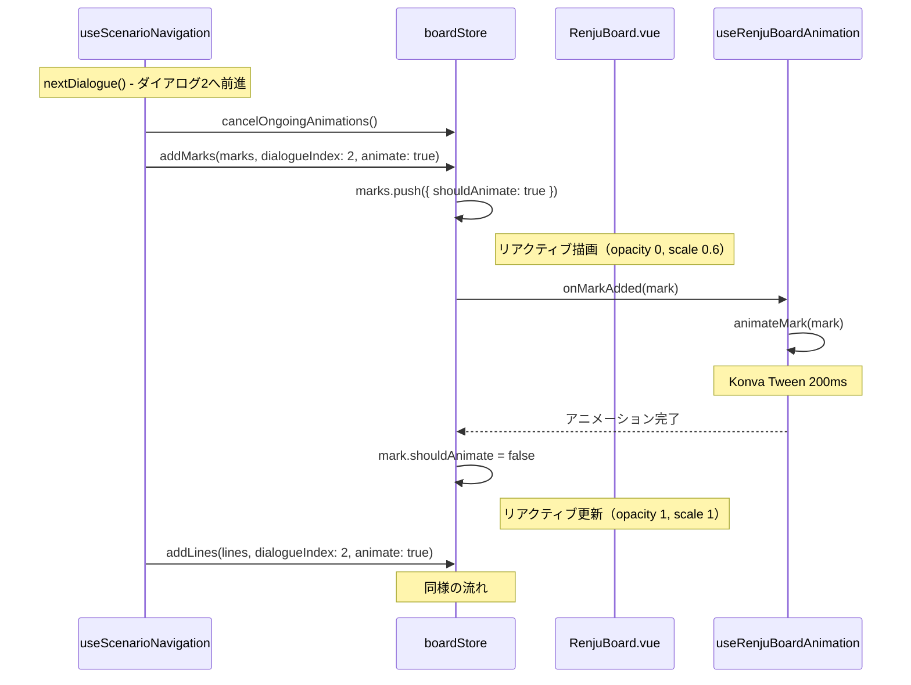

# マーク・ラインアニメーション設計

## 背景

石配置アニメーション（`docs/animation-redesign.md`）の実装パターンを踏襲し、マーク・ラインにも表示時のアニメーションを実装する。

### 現状の問題点

1. **管理方式の不統一**: 石はboardStoreで管理、マーク・ラインはScenarioPlayer.vueのcomputedで管理
2. **アニメーションなし**: マーク・ラインは即座に表示される
3. **以前の実装は不安定**: watch + refキー追跡方式で「アニメーションされたりされなかったり」

## あるべき動作

```
1.進む(マークなし) → 2.進む(マーク表示、アニメーションあり) → 3.進む(マーク表示済み)
3.戻る(マーク表示済み) → 2.戻る(マーク表示済み) → 1.戻る(マーク消える)
```

- マーク・ラインはダイアログに紐づく
- 前進時: そのダイアログで追加されるマーク・ラインのみアニメーション
- 後退時: アニメーションなし、キャッシュから復元
- 連打時: 進行中のアニメーションをキャンセルし、即時表示

## 設計方針

### 核心: マーク・ラインにもIDとダイアログインデックスを紐づけ

```typescript
interface Mark {
  id: string;
  positions: Position[];
  markType: "circle" | "cross" | "arrow";
  label?: string;
  placedAtDialogueIndex: number;
  shouldAnimate: boolean;
}

interface Line {
  id: string;
  fromPosition: Position;
  toPosition: Position;
  style: "solid" | "dashed";
  placedAtDialogueIndex: number;
  shouldAnimate: boolean;
}
```

### アニメーション仕様

| 要素   | 初期状態               | 最終状態             | 時間  | 効果                    |
| ------ | ---------------------- | -------------------- | ----- | ----------------------- |
| マーク | opacity: 0, scale: 0.6 | opacity: 1, scale: 1 | 0.2秒 | フェードイン + スケール |
| ライン | opacity: 0             | opacity: 1           | 0.2秒 | フェードイン            |

### 責務の整理（石と統一）

| 責務                       | 担当                                           |
| -------------------------- | ---------------------------------------------- |
| ダイアログインデックス管理 | useScenarioNavigation                          |
| マーク・ラインデータ管理   | boardStore                                     |
| アニメーション実行         | useRenjuBoardAnimation                         |
| 描画                       | RenjuBoard.vue（boardStore.marks/linesを参照） |

### 呼び出しフロー



## 実装詳細

### boardStore.ts への追加

```typescript
// 型定義
export interface Mark {
  id: string;
  positions: Position[];
  markType: "circle" | "cross" | "arrow";
  label?: string;
  placedAtDialogueIndex: number;
  shouldAnimate: boolean;
}

export interface Line {
  id: string;
  fromPosition: Position;
  toPosition: Position;
  style: "solid" | "dashed";
  placedAtDialogueIndex: number;
  shouldAnimate: boolean;
}

// State
const marks = ref<Mark[]>([]);
const lines = ref<Line[]>([]);

// 呼び出しID管理
let currentAddMarksId: number | null = null;
let currentAddLinesId: number | null = null;
let addMarksIdCounter = 0;
let addLinesIdCounter = 0;

// Callbacks
type OnMarkAddedCallback = (mark: Mark) => Promise<void>;
type OnLineAddedCallback = (line: Line) => Promise<void>;
let onMarkAddedCallback: OnMarkAddedCallback | null = null;
let onLineAddedCallback: OnLineAddedCallback | null = null;

// Actions
async function addMarks(
  newMarks: {
    positions: Position[];
    markType: "circle" | "cross" | "arrow";
    label?: string;
  }[],
  dialogueIndex: number,
  options?: { animate?: boolean },
): Promise<void> {
  const callId = ++addMarksIdCounter;
  currentAddMarksId = callId;
  let shouldAnimate = options?.animate !== false;

  for (let i = 0; i < newMarks.length; i++) {
    if (currentAddMarksId !== callId) {
      shouldAnimate = false;
    }

    const markData = newMarks[i];
    const id = `${dialogueIndex}-mark-${i}`;
    const newMark: Mark = {
      id,
      ...markData,
      placedAtDialogueIndex: dialogueIndex,
      shouldAnimate,
    };
    marks.value.push(newMark);

    if (shouldAnimate && onMarkAddedCallback) {
      await onMarkAddedCallback(newMark);
      if (currentAddMarksId !== callId) {
        shouldAnimate = false;
      }
      newMark.shouldAnimate = false;
    }
  }
}

async function addLines(
  newLines: {
    fromPosition: Position;
    toPosition: Position;
    style?: "solid" | "dashed";
  }[],
  dialogueIndex: number,
  options?: { animate?: boolean },
): Promise<void> {
  const callId = ++addLinesIdCounter;
  currentAddLinesId = callId;
  let shouldAnimate = options?.animate !== false;

  for (let i = 0; i < newLines.length; i++) {
    if (currentAddLinesId !== callId) {
      shouldAnimate = false;
    }

    const lineData = newLines[i];
    const id = `${dialogueIndex}-line-${i}`;
    const newLine: Line = {
      id,
      fromPosition: lineData.fromPosition,
      toPosition: lineData.toPosition,
      style: lineData.style ?? "solid",
      placedAtDialogueIndex: dialogueIndex,
      shouldAnimate,
    };
    lines.value.push(newLine);

    if (shouldAnimate && onLineAddedCallback) {
      await onLineAddedCallback(newLine);
      if (currentAddLinesId !== callId) {
        shouldAnimate = false;
      }
      newLine.shouldAnimate = false;
    }
  }
}

function clearMarks(): void {
  currentAddMarksId = null;
  marks.value = [];
}

function clearLines(): void {
  currentAddLinesId = null;
  lines.value = [];
}

// resetAll（石・マーク・ライン全クリア）
function resetAll(): void {
  cancelOngoingAnimations();
  stones.value = [];
  marks.value = [];
  lines.value = [];
  resetBoard();
}

// cancelOngoingAnimations の拡張
function cancelOngoingAnimations(): void {
  currentAddStonesId = null;
  currentAddMarksId = null;
  currentAddLinesId = null;

  if (onAnimationCancelCallback) {
    onAnimationCancelCallback();
  }

  for (const stone of stones.value) {
    if (stone.shouldAnimate) stone.shouldAnimate = false;
  }
  for (const mark of marks.value) {
    if (mark.shouldAnimate) mark.shouldAnimate = false;
  }
  for (const line of lines.value) {
    if (line.shouldAnimate) line.shouldAnimate = false;
  }
}
```

### useRenjuBoardAnimation.ts への追加

```typescript
import type { Mark, Line } from "@/stores/boardStore";

// 返り値の型を拡張
{
  stoneRefs: Record<string, unknown>;
  markRefs: Record<string, unknown>;
  lineRefs: Record<string, unknown>;
  animateStone: (position: Position) => Promise<void>;
  animateMark: (mark: Mark) => Promise<void>;
  animateLine: (line: Line) => Promise<void>;
  finishAllAnimations: () => void;
}

// 追加するrefs
const markRefs: Record<string, unknown> = {};
const lineRefs: Record<string, unknown> = {};

// マークアニメーション
const animateMark = (mark: Mark): Promise<void> =>
  new Promise((resolve) => {
    nextTick(() => {
      const markKey = mark.id;
      const nodeRef = markRefs[markKey];
      if (!nodeRef) {
        resolve();
        return;
      }

      // @ts-expect-error: Vue template ref methods
      const konvaNode = nodeRef.getNode?.();
      if (!konvaNode) {
        resolve();
        return;
      }

      const tween = new Konva.Tween({
        node: konvaNode,
        duration: 0.2,
        opacity: 1,
        scaleX: 1,
        scaleY: 1,
        easing: Konva.Easings.EaseOut,
        onFinish: () => {
          activeTweens.delete(markKey);
          resolve();
        },
      });

      activeTweens.set(markKey, tween);
      tween.play();
    });
  });

// ラインアニメーション
const animateLine = (line: Line): Promise<void> =>
  new Promise((resolve) => {
    nextTick(() => {
      const lineKey = line.id;
      const nodeRef = lineRefs[lineKey];
      if (!nodeRef) {
        resolve();
        return;
      }

      // @ts-expect-error: Vue template ref methods
      const konvaNode = nodeRef.getNode?.();
      if (!konvaNode) {
        resolve();
        return;
      }

      const tween = new Konva.Tween({
        node: konvaNode,
        duration: 0.2,
        opacity: 1,
        easing: Konva.Easings.EaseOut,
        onFinish: () => {
          activeTweens.delete(lineKey);
          resolve();
        },
      });

      activeTweens.set(lineKey, tween);
      tween.play();
    });
  });
```

### RenjuBoard.vue の変更

```typescript
// boardStoreからマーク・ラインを参照
const scenarioMarks = computed(() => boardStore.marks);
const scenarioLines = computed(() => boardStore.lines);

// コールバック登録
onMounted(() => {
  // 既存の石コールバック...

  boardStore.setOnMarkAddedCallback(async (mark: Mark) => {
    await animation.animateMark(mark);
  });

  boardStore.setOnLineAddedCallback(async (line: Line) => {
    await animation.animateLine(line);
  });
});
```

```vue
<!-- テンプレート: ライン描画 -->
<v-line
  v-for="line in scenarioLines"
  :key="line.id"
  :ref="(el: unknown) => { if (el) animation.lineRefs[line.id] = el; }"
  :config="{
    points: [...],
    stroke: '#FF0000',
    strokeWidth: 3,
    dash: line.style === 'dashed' ? [10, 5] : undefined,
    opacity: line.shouldAnimate ? 0 : 1,
  }"
/>

<!-- テンプレート: マーク描画（v-groupでまとめてスケール） -->
<v-group
  v-for="mark in scenarioMarks"
  :key="mark.id"
  :ref="(el: unknown) => { if (el) animation.markRefs[mark.id] = el; }"
  :config="{
    opacity: mark.shouldAnimate ? 0 : 1,
    scaleX: mark.shouldAnimate ? 0.6 : 1,
    scaleY: mark.shouldAnimate ? 0.6 : 1,
  }"
>
  <!-- マーク要素（circle/cross/arrow） -->
</v-group>
```

### useScenarioNavigation.ts の変更

```typescript
// BoardSnapshot拡張
interface BoardSnapshot {
  board: BoardState;
  stones: Stone[];
  marks: Mark[];
  lines: Line[];
}

// showDialogueWithAction拡張
const showDialogueWithAction = async (
  dialogue: DemoDialogue,
  animate: boolean,
): Promise<void> => {
  showDialogueMessage(dialogue);

  // 石の追加（既存）
  const placeActions = dialogue.boardActions.filter((a) => a.type === "place");
  if (placeActions.length > 0) {
    await boardStore.addStones(...);
  }

  // マークの追加
  const markActions = dialogue.boardActions.filter((a) => a.type === "mark");
  if (markActions.length > 0) {
    await boardStore.addMarks(
      markActions.map((a) => ({
        positions: a.positions,
        markType: a.markType,
        label: a.label,
      })),
      currentDialogueIndex.value,
      { animate },
    );
  }

  // ラインの追加
  const lineDrawActions = dialogue.boardActions.filter(
    (a) => a.type === "line" && a.action === "draw"
  );
  if (lineDrawActions.length > 0) {
    await boardStore.addLines(
      lineDrawActions.map((a) => ({
        fromPosition: a.fromPosition,
        toPosition: a.toPosition,
        style: a.style,
      })),
      currentDialogueIndex.value,
      { animate },
    );
  }

  // resetAllの処理
  for (const action of dialogue.boardActions) {
    if (action.type === "resetAll") {
      boardStore.resetAll();
    }
    // ...
  }
};
```

### ScenarioPlayer.vue の変更

- `currentMarks` computed を削除
- `currentLines` computed を削除
- RenjuBoardへの`marks`/`lines` propsを削除

## ファイル変更一覧

| ファイル                                                                       | 変更内容                                                                          |
| ------------------------------------------------------------------------------ | --------------------------------------------------------------------------------- |
| `src/stores/boardStore.ts`                                                     | Mark/Line型、marks/lines state、addMarks/addLines/clearMarks/clearLines、resetAll |
| `src/components/game/RenjuBoard/composables/useRenjuBoardAnimation.ts`         | animateMark/animateLine、markRefs/lineRefs                                        |
| `src/components/game/RenjuBoard/RenjuBoard.vue`                                | boardStore.marks/lines参照、コールバック登録、テンプレート変更                    |
| `src/components/scenarios/ScenarioPlayer/composables/useScenarioNavigation.ts` | mark/lineアクション処理、BoardSnapshotにmarks/lines追加                           |
| `src/components/scenarios/ScenarioPlayer/ScenarioPlayer.vue`                   | currentMarks/currentLines computed削除                                            |

## 期待される効果

1. **アーキテクチャの統一**: 石・マーク・ライン全てがboardStoreで管理
2. **アニメーション追加**: マーク・ライン表示時のフェードイン/スケール効果
3. **連打対応**: 石と同様のキャンセル機構
4. **キャッシュ対応**: 戻る操作でアニメーションなしで復元
