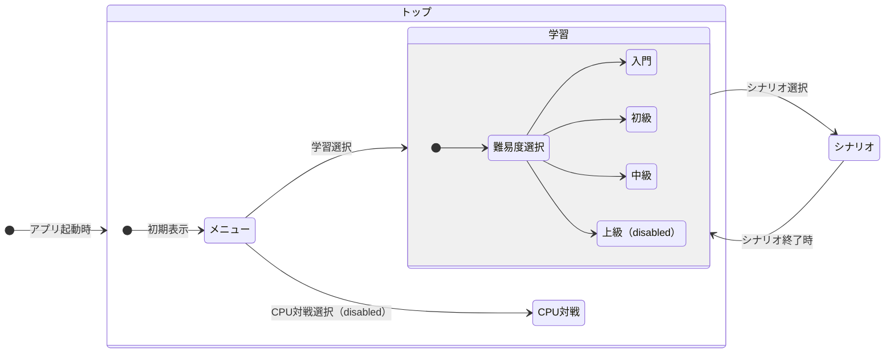
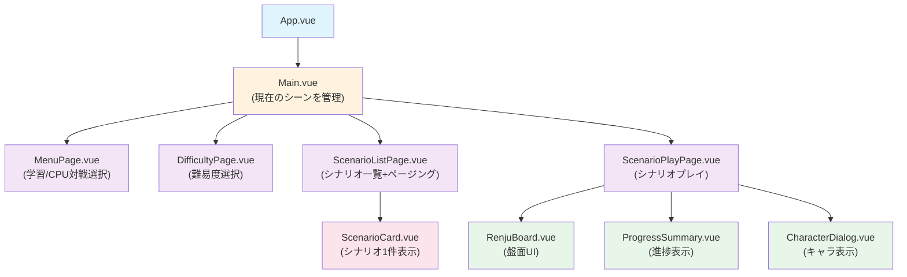

# ページ設計

## ページ遷移



## コンポーネント構成



## ストア構成

### appStore（新規）

- `currentScene`: 'menu' | 'difficulty' | 'scenarioList' | 'scenarioPlay' （現在のシーン）
- `selectedMode`: 'training' | 'cpu' （選択中のモード）
- `selectedDifficulty`: 'beginner' | 'intermediate' | 'advanced' （選択中の難易度）
- `currentPage`: number （シナリオ一覧のページ番号）

### gameStore（既存・拡張）

- `currentScenario`: Scenario | null
- `moves`: Move[] （現在のゲーム状態）
- `canUndo`: boolean
- その他ゲーム進行に関連する状態

### progressStore（既存・拡張）

- `completedScenarios`: Set<string> （クリア済みシナリオID）
- `attemptCount`: Map<string, number> （シナリオごとの挑戦回数）
- `getScenarioProgress(scenarioId)`: 指定シナリオの進捗情報を取得

### dialogStore（既存）

- キャラクター表示の管理（継続）

## シナリオ一覧

- 固定画面のためページングを行う。スクロールは不可。

## 考慮事項

### ステートマシン化について

現在の設計は単純な状態フラグによるアプローチを取っている。ステートマシン化（xstate等）については以下を考慮：

**メリット：**

- 不正な状態遷移を完全に防止（例：difficulty選択なしでscenarioListに遷移不可）
- 状態の組み合わせが爆発しない
- 状態遷移のロジックが明確になる

**デメリット：**

- 導入コストが増加
- コード量増加
- 現在の遷移パターンが単純なため得られるメリットが相対的に小さい

**判断：** 当面は現在の設計で実装し、状態管理が複雑化した段階で検討する。

### 状態遷移の制約

appStoreのアクションで以下の制約をチェック：

- `selectDifficulty()`は`selectedMode === 'training'`の時のみ実行可能
- `goToScenarioList()`は`selectedDifficulty`が選ばれている時のみ実行可能
- `goToScenarioPlay()`は`currentPage`からシナリオが選択されている時のみ実行可能

### ページング実装

- シナリオ一覧はクライアント側で難易度ごとにグループ化・ページング
- データは`data/scenarios/`に複数JSONで保持
- 1ページあたりの表示数は画面サイズに合わせて決定

### 進捗管理

- `progressStore`でシナリオIDごとのクリア状態を管理
- ScenarioCard表示時にクリア済みバッジを表示
- 進捗データは localStorage に保存（今後実装）

## 実装詳細

### ページングUI

- グリッドレイアウトで列数を調整可能（表示数は柔軟に決定）
- ページ遷移方法：
  - 前へ/次へボタン
  - 矢印キー（左右）
  - スクロール/スワイプイベント
- ページ表示：「1/5」形式で数字表示

### ScenarioCard の表示内容

- タイトル
- 説明文
- 開始ボタン
- クリア状態バッジ（クリア済みなら表示）
- サムネイル画像（将来実装、CSS背景でプリペア）

### シナリオデータ構成

現在の構成：`data/scenarios/*.json`
↓ 変更予定：

```
data/
  scenarios/
    index.json        （メタデータ）
    beginner/
      sc001.json
      sc002.json
      ...
    intermediate/
      sc101.json
      sc102.json
      ...
    advanced/
      sc201.json
      ...
```

### ゲーム終了時の遷移

- シナリオ終了→クリア状態を progressStore に記録
- シナリオ一覧に戻る際、その難易度内の**未クリアシナリオが最初に表示される位置**にページングを設定
- ページング位置をセッション中は appStore に保持

### クリア時の演出

- シナリオ移動時・クリア時にカットイン演出を表示（アニメーション）
- クリア後のボタン選択：
  - 「次のシナリオへ」→ 次の未クリアシナリオを表示
  - 「シナリオ一覧に戻る」→ 一覧画面へ遷移

### キーボード操作

- 後からの対応でOK
- 優先度：矢印キー > その他

### エラーハンドリング

- シナリオ読み込み失敗時→ dialogStore でエラーメッセージを表示
- 対象：ファイル読み込み失敗、不正なデータ形式
- シナリオ作成者はプロジェクト管理者（ユーザー作成なし）→ データ品質保証は手動チェック

### ブラウザ戻る・進む機能

History API を使用してアプリ内シーン遷移に対応：

**実装方法：**

- シーン遷移時に `window.history.pushState()` で状態を履歴に追加
  ```javascript
  window.history.pushState(
    { scene, selectedMode, selectedDifficulty, currentPage },
    "",
    `#${scene}`,
  );
  ```
- ブラウザの戻る/進むで `popstate` イベント発火
- イベントハンドラで `state` から状態を復元して UI を更新

**シナリオプレイ中の戻る確認：**

- `currentScene === 'scenarioPlay'` の時、`popstate` 発火時にダイアログ表示
- ユーザー確認：
  - 「戻る」→ 状態を復元してシナリオ一覧に遷移
  - 「続ける」→ `window.history.forward()` で履歴を進めて元に戻す
- その他のシーンでは確認なしで遷移

**appStore に追加するメソッド：**

- `restoreState(state)`: state オブジェクトから状態を復元
- `pushHistory(state)`: 状態を履歴に追加
