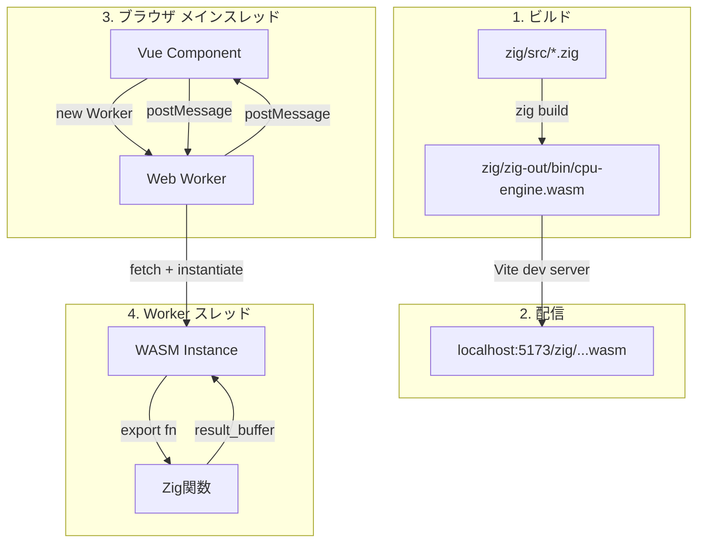
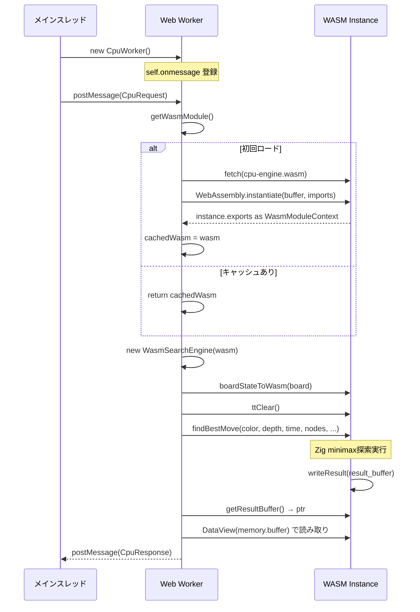
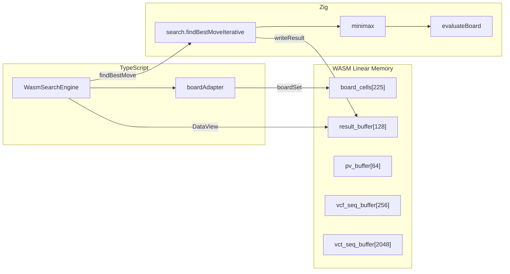

# Zig+WASM 実行フロー

Zigソースコードからブラウザの Web Worker で実行されるまでの全体フロー。

## 全体像



## 1. ビルド

```
zig/src/main.zig          # エントリポイント（export関数を定義）
  ├── board.zig            # 盤面 [225]Cell
  ├── search.zig           # 反復深化 + preSearch
  ├── minimax.zig          # Alpha-Beta + NMP/LMR/Futility/PVS
  ├── evaluate.zig         # 盤面評価
  ├── move_order.zig       # 候補手ソート
  ├── tt.zig               # Transposition Table (2Mエントリ)
  ├── zobrist.zig          # Zobristハッシュ
  ├── vcf.zig              # VCF探索
  ├── vct.zig              # VCT探索
  ├── mise_vcf.zig         # Mise-VCF探索
  ├── threats.zig          # 脅威検出
  ├── forbidden.zig        # 禁手判定
  └── ...
```

```bash
pnpm build:wasm   # = cd zig && zig build
```

- **ターゲット**: `wasm32-freestanding`
- **最適化**: `ReleaseFast`
- **出力**: `zig/zig-out/bin/cpu-engine.wasm`

### WASM export関数

```zig
// 盤面操作
export fn boardInit() void
export fn boardGet(row: u8, col: u8) u8
export fn boardSet(row: u8, col: u8, value: u8) void

// 探索
export fn findBestMove(color, maxDepth, timeLimit, maxNodes, absTimeLimit, aspirationMode) void
export fn getResultBuffer() [*]u8
export fn ttClear() void

// PV抽出
export fn extractPV(bestRow, bestCol, color, maxLen) void
export fn getResultPVBuffer() [*]u8

// VCF/VCT/Mise-VCF Sequence
export fn findVCFSequenceWasm(color, maxDepth, timeLimit, maxNodes) void
export fn findVCTSequenceWasm(color, maxDepth, timeLimit, maxNodes, collectBranches) void
export fn findMiseVCFSequenceWasm(color, timeLimit, maxNodes) void
// + 各 getXxxBuffer(), fromFirstMove 版
```

### Import（JS→WASM）

```zig
extern fn getTimestampMsExternal() u32;
// → JS側: () => Math.round(performance.now())
// 用途: 探索の時間制限チェック
```

## 2. Vite配信

- `loader.ts` で相対パスからWASM URLを構築:
  ```
  new URL("../../../../zig/zig-out/bin/cpu-engine.wasm", import.meta.url)
  ```
- 開発サーバー: Viteが自動配信（特別な設定なし）
- 本番ビルド: アセットとしてコピー

## 3. Worker起動〜WASM初期化



### 環境分岐

| 環境                         | WASMロード方式                                   |
| ---------------------------- | ------------------------------------------------ |
| ブラウザ                     | `fetch(wasmUrl).arrayBuffer()`                   |
| Node.js（テスト/スクリプト） | `fs.readFileSync(fileURLToPath(wasmUrl)).buffer` |

### フォールバック

WASM ロード失敗時はTS版探索関数にフォールバック（`findBestMoveIterativeWithTT`）。

## 4. TS→WASM呼び出しフロー



### 盤面コピー

```typescript
boardStateToWasm(wasm, board);
// 1. wasm.boardInit()     → board_cells を全0クリア
// 2. 15x15ループ
//    wasm.boardSet(row, col, 1)  // black
//    wasm.boardSet(row, col, 2)  // white
```

### 結果バッファ

```
result_buffer[128]:
  [0]:      row (u8)
  [1]:      col (u8)
  [2..5]:   score (i32, little-endian)
  [6]:      completedDepth (u8)
  [7]:      candidateCount (u8)
  [8..67]:  候補手 × 最大10（各6バイト: row, col, score[i32])
```

```typescript
const ptr = wasm.getResultBuffer();
const view = new DataView(wasm.memory.buffer);
const row = view.getUint8(ptr);
const score = view.getInt32(ptr + 2, true); // little-endian
```

## 5. Worker構成

| Worker           | 管理Composable     | 用途         | WASMインスタンス      |
| ---------------- | ------------------ | ------------ | --------------------- |
| cpu.worker.ts    | useCpuPlayer       | CPU対局思考  | 1個（キャッシュ）     |
| review.worker.ts | useReviewEvaluator | 振り返り評価 | プール2-8個（各独立） |

各Workerが独立したWASMインスタンス（独立した線形メモリ）を持つため、並列実行が安全。

## 6. 開発フロー

```bash
# Zigソースを編集
vim zig/src/minimax.zig

# WASMをリビルド
pnpm build:wasm

# 開発サーバー起動（初回のみ）
pnpm dev

# ブラウザリロードで新しいWASMが読まれる
# ※ Workerのキャッシュはリロードでクリアされる
```
