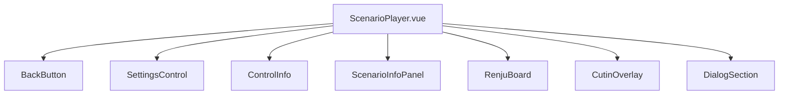
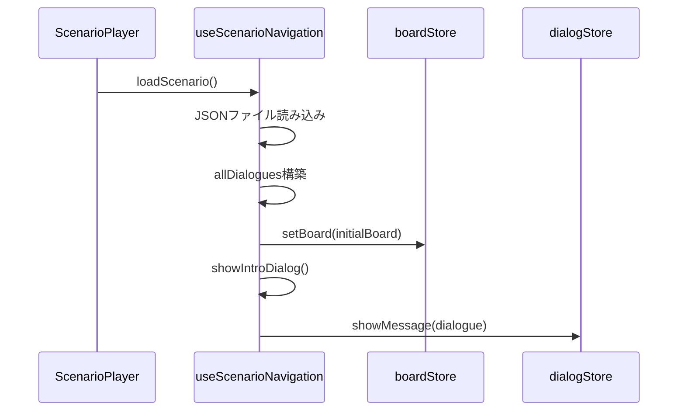
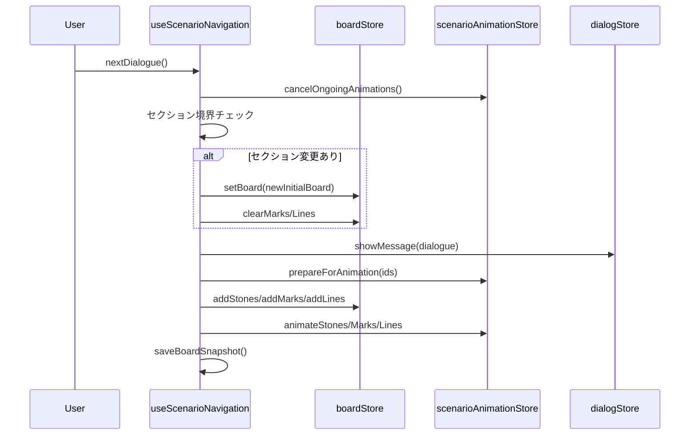
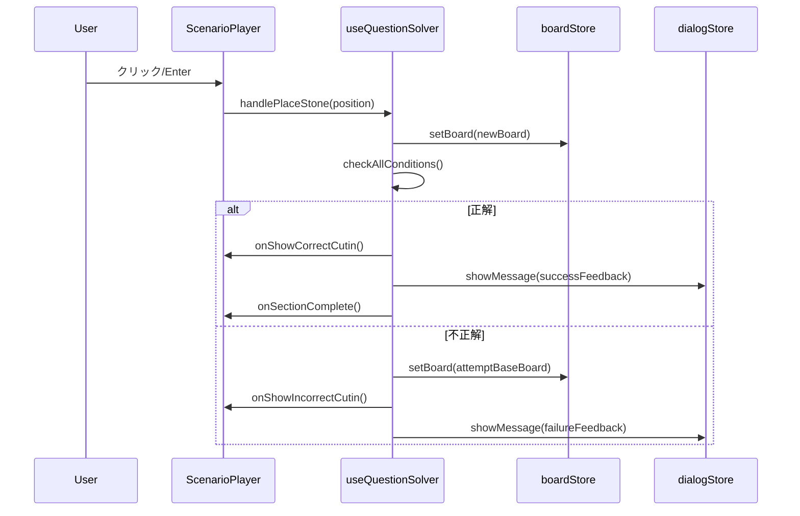
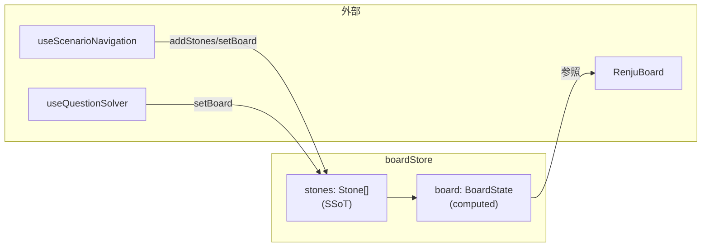

# ScenarioPlayer

シナリオ学習の中核コンポーネント。連珠の戦略をキャラクターの会話を通じて学ぶ「デモモード」と、実際に石を配置して問題を解く「問題モード」を提供する。

## 概要

- **デモモード**: キャラクターの会話に合わせて盤面が変化し、戦略を解説
- **問題モード**: ユーザーが正解の位置に石を配置する問題を出題

## コンポーネント構成



### レイアウト（CSS Grid）

```
┌─────────────┬───────────────┬─────────────┐
│  control    │    board      │    info     │
│  (4fr)      │    (7fr)      │    (5fr)    │
│             │               │             │
│  BackButton │  RenjuBoard   │  Scenario   │
│  Settings   │  CutinOverlay │  InfoPanel  │
│  ControlInfo│               │             │
├─────────────┴───────────────┤             │
│      dialog (11fr)          │             │
│      DialogSection          │             │
└─────────────────────────────┴─────────────┘
```

## Composables

| Composable              | 役割                                        |
| ----------------------- | ------------------------------------------- |
| `useScenarioNavigation` | シナリオ読み込み、セクション/ダイアログ移動 |
| `useKeyboardNavigation` | WASD カーソル移動、Space/Enter で石配置     |
| `useQuestionSolver`     | 問題の正誤判定、フィードバック表示          |
| `useCutinDisplay`       | ○/× カットインの表示・自動消滅管理          |
| `useBoardSize`          | ボードフレームサイズの監視・計算            |
| `problemConditions`     | 成功条件（position/pattern/sequence）の評価 |

## 関連ストア

| Store                    | 役割                                   |
| ------------------------ | -------------------------------------- |
| `boardStore`             | 盤面状態（stones がSSoT）              |
| `scenarioAnimationStore` | 石・マーク・ラインのアニメーション制御 |
| `dialogStore`            | キャラクターのセリフ表示               |
| `progressStore`          | 学習進捗の記録                         |
| `appStore`               | 画面遷移                               |

## データフロー

### シナリオ読み込み



### ダイアログナビゲーション（デモモード）



### 問題解答フロー



## SSoT（Single Source of Truth）

盤面状態は`boardStore.stones`をSSoTとして管理。`board`は`stones`から computed で導出される。



## キャッシュ機構（boardCache）

ダイアログを戻る操作を高速化するため、各ダイアログ時点の盤面スナップショットをキャッシュ。

```
boardCache: Map<sectionIndex, Map<dialogueIndex, BoardSnapshot>>

BoardSnapshot {
  stones: Stone[]         // 石のリスト（SSoT）
  marks: Mark[]           // マークのリスト
  lines: Line[]           // ラインのリスト
  descriptionNodes: TextNode[]  // 説明文
}
```

- **保存タイミング**: `nextDialogue()`完了後、`showIntroDialog()`完了後
- **復元タイミング**: `previousDialogue()`時にキャッシュがあれば使用
- **クリアタイミング**: `loadScenario()`時
